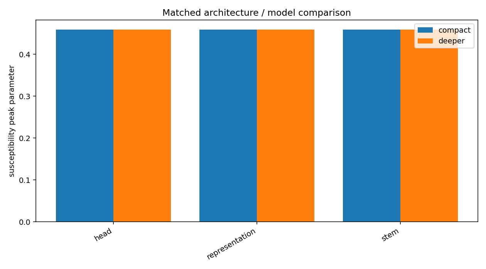

# Architecture development with Eigenflow

This guide shows how to use Eigenflow as development instrumentation when comparing candidate architectures. The objective is not to rank models by a generic representation-quality score. It is to test a structural hypothesis under a matched measurement design.

## 1. State the architectural hypothesis

Start with the mechanism you expect to matter.

Examples:

- a bottleneck should preserve target structure while suppressing nuisance structure;
- a residual block should reorganize a probe population rather than merely change activation magnitude;
- a deeper candidate should create a target-aligned structure that a shallower candidate does not;
- an attention stage should introduce a relational organization that is absent at its input.

The hypothesis determines the probe design and the representation sites that must be captured.

## 2. Use one fixed probe population

Comparing architectures requires a common measurement instrument. Construct the probe population once and use it for every candidate.

```python
probes = ef.ProbePopulation.from_items(
    probe_inputs,
    metadata=probe_metadata,
    name="architecture_probe",
)
```

If target identity and background are competing explanations, cross both factors rather than sampling them opportunistically.

## 3. Expose comparable semantic sites

Raw layer number is usually a weak correspondence across architectures. Prefer named functional locations.

The runnable example defines the same three semantic sites in both candidates:

```python
sites = ["stem", "representation", "head"]
```

If exact semantic names are impossible, declare an explicit `SiteAlignment`. Normalized-depth alignment exists for diagnostics but is not evidence of semantic equivalence.

## 4. Run matched experiments

```python
from eigenflow.development import ExperimentSeries, BehavioralRecord

series = ExperimentSeries("architecture_candidates")

for name, model in candidates.items():
    result = series.add_experiment(
        name,
        ef.Experiment(
            model,
            probes,
            extraction=ef.ExtractionConfig(sites=sites),
            filtration=ef.filtrations.EdgeDensityFiltration(
                start=0,
                stop=0.65,
                steps=18,
            ),
            analyses=[
                "components",
                "percolation",
                "spectra",
                "factor_alignment",
                "class_structure",
            ],
        ),
        architecture=name,
        behavior=BehavioralRecord({"validation_accuracy": accuracy[name]}),
    )
```

`ExperimentSeries` validates every new entry against the first result. An accidental metric, reducer, probe, filtration, or preprocessing change is therefore surfaced instead of silently entering the comparison.

## 5. Inspect compatibility explicitly

```python
reports = series.compatibility_matrix()
report = reports[("compact", "deeper")]
print(report.compatible)
```

A comparison should not proceed merely because two arrays have the same shape.

## 6. Compare behavior and structure separately

The included example trains two candidates to the same training accuracy, then compares their structural transition summaries.

```text
Compatibility: True
Behavior: {'compact': {'training_accuracy': 1.0},
           'deeper': {'training_accuracy': 1.0}}
Structural summary sites: ['head', 'representation', 'stem']
```

Equal behavioral performance does not imply equal internal organization. Conversely, a structural difference does not make one architecture universally better. The experiment must state which structural outcome was predicted by the architectural hypothesis.

## 7. Visualize the matched comparison

```python
fig = ef.visualization.architecture_comparison(series)
```



The default comparison view displays a selected scalar structural observable by aligned representation site for every candidate. It is most useful for quickly locating where candidates diverge. Follow it with the underlying layer-by-control trajectories rather than interpreting the bar heights in isolation.

## 8. Use structural diffs when the sites and measurements match

For two compatible entries:

```python
from eigenflow.development import StructuralDiff

diff = StructuralDiff.between(series["compact"], series["deeper"])
```

`StructuralDiff` retains both absolute values and the difference. This is important because a large delta can come from two qualitatively different regimes.

## 9. Interpret the result as an architecture experiment

A useful conclusion has this form:

> Under the fixed probe population, reducer, metric, filtration, and analysis configuration, candidate B shows stronger target-factor organization at the representation stage while both candidates achieve similar behavioral performance. This supports the stated hypothesis that B's additional transformation changes the measured representation geometry in the predicted direction.

It should also state alternatives: the result may depend on the probe design, reducer, metric, training seed, or site correspondence.

## 10. Reproduce the complete example

Run:

```bash
python examples/architecture_comparison.py
```

The script trains both models, constructs the matched `ExperimentSeries`, prints compatibility and behavioral summaries, and writes `architecture_comparison.png`.
