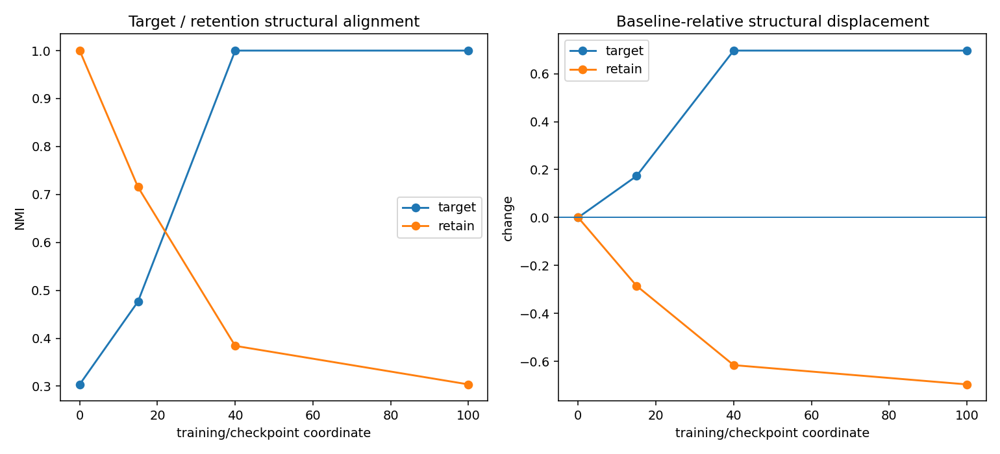
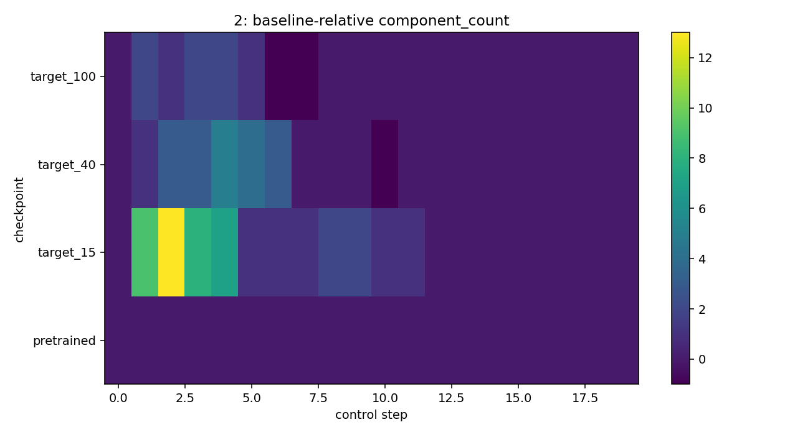

# Fine-tuning and post-training with Eigenflow

A pretrained model provides a natural structural baseline. Post-training can therefore be studied as a trajectory of representation change rather than only as a final benchmark score.

The central object is

\[
Q(\ell,p,t),
\]

where \(t\) indexes checkpoints or training progress.

## 1. Separate target acquisition from retention

A fine-tuning experiment should not use one undifferentiated probe set when the engineering question has multiple obligations.

A common design is:

```python
suite = ProbeSuite({
    "target": target_probes,
    "retain": retention_probes,
    "nuisance": nuisance_probes,
    "boundary": boundary_probes,
}, name="post_training_suite", version="v1")
```

Not every study needs all four roles, but target and retention should be distinguished whenever forgetting matters.

## 2. Hold each probe role fixed across checkpoints

A longitudinal claim requires the same measurement instrument at every checkpoint. Each role therefore receives its own `ExperimentSeries`.

```python
by_role = {
    role: ExperimentSeries(f"{role}_checkpoint_series")
    for role in suite.roles
}
```

For each checkpoint, load the model and run the same Eigenflow configuration for the same role-specific probes.

## 3. Attach behavioral metrics without conflating them with structure

```python
behavior = BehavioralRecord({
    "target_accuracy": target_accuracy,
    "retain_accuracy": retain_accuracy,
})
```

The behavioral record is attached to the checkpoint entry. Eigenflow does not transform accuracy into a structural score or vice versa.

## 4. Build the checkpoint series

```python
for key, step, state in checkpoints:
    model.load_state_dict(state)
    for role, probes in suite.populations.items():
        by_role[role].add_experiment(
            key,
            make_experiment(model, probes, role),
            time=step,
            checkpoint=key,
            behavior=behavior,
        )
```

Every addition is compatibility-checked against that role's baseline.

## 5. Summarize target acquisition and retention

```python
from eigenflow.development import retention_summary

summary = retention_summary(by_role)
```

The included runnable example produces a deliberately interpretable tradeoff. The pretrained checkpoint begins with perfect retention performance and chance target performance. Fine-tuning acquires the target while retained behavior deteriorates.

The corresponding structural summary moves in the same qualitative direction:

```text
pretrained: target alignment ≈ 0.39, retention alignment = 1.00
target_40:  target alignment = 1.00, retention alignment ≈ 0.57
target_100: target alignment = 1.00, retention alignment ≈ 0.40
```

Those values are not universal thresholds. They are measurements from this controlled synthetic example.

## 6. Read the retention dashboard

```python
fig = ef.visualization.retention_dashboard(by_role)
```



The left panel shows role-specific structural alignment across checkpoints. The right panel expresses the same measurements relative to the pretrained baseline.

A desirable direction depends on the role. Increasing target organization may be the intended learning signal while decreasing retention organization may be evidence of forgetting.

## 7. Inspect the full longitudinal surface

```python
longitudinal = by_role["target"].longitudinal()
fig = ef.visualization.longitudinal_surface(
    longitudinal,
    site,
    "components",
    "component_count",
    baseline_delta=True,
)
```



Rows correspond to checkpoints and columns to control-scale steps. This preserves the relational-scale dimension instead of collapsing every checkpoint to one scalar.

## 8. Diagnose where plasticity occurred

```python
from eigenflow.development import peft_targeting_scores

scores = peft_targeting_scores(by_role["target"])
```

The helper ranks representation sites by baseline-relative structural change. It is a diagnostic for where the current fine-tuning run changed the measured organization.

It does **not** automatically prove where a LoRA adapter or trainable block should be placed. A targeting decision should be tested by a new controlled intervention.

## 9. Select checkpoints with an explicit objective

Eigenflow does not impose a universal early-stopping score. Instead, supply a transparent decision rule:

```python
from eigenflow.development import select_checkpoint

selection = select_checkpoint(
    by_role["target"],
    lambda entry: (
        entry.behavior.metrics["target_accuracy"]
        - 0.5 * max(0, 1 - entry.behavior.metrics["retain_accuracy"])
    ),
)
```

The objective is part of the engineering decision, not a package-defined truth.

## 10. Inspect training data when structure is unexpected

`training_data_diagnostics(...)` surfaces bridge probes and factor-alignment peaks for qualitative inspection. Bridge cases may be mislabeled, ambiguous, legitimate boundaries, or simply structurally pivotal under the current measurement.

The helper identifies candidates for inspection; it does not label data as erroneous automatically.

## 11. Run the complete example

```bash
python examples/fine_tuning_checkpoints.py
```

The script performs real optimization, stores four checkpoints, runs the same Eigenflow measurement at every checkpoint for target and retention probe populations, prints the behavioral/structural trajectory, and writes the two figures shown above.
