# Visualization guide

Eigenflow visualizations are part of the experimental interface. A plot is justified by the inferential question it helps answer, not merely because an analysis produces a numeric array.

This guide uses the real outputs from `examples/complete_visualization_demo.py`. The demonstration trains a three-class MLP and analyzes an exactly balanced **3 class × 2 background** held-out probe population with 10 probes per factorial cell. The classifier achieves 100% held-out probe accuracy. The primary run uses cosine similarity and an edge-density filtration; a matched Euclidean-distance run is used for robustness comparison.

The complete generated archive contains the figures below, numeric tables, `result.json`, the trained model state, configuration/environment metadata, a figure manifest, and SHA-256 checksums.

## Visual evidence tiers

Eigenflow distinguishes three roles for figures.

**Primary evidential views** expose the measured relational or structural object directly and may contribute to a substantive interpretation.

**Diagnostic views** help explain anomalies, pivotal probes, localization, or a selected graph state. They should not become the primary semantic evidence simply because they are visually compelling.

**Summary/report views** combine validated primary views so the analyst can compare or communicate an experiment without hiding the underlying measurements.

## 1. Probe design

```python
fig = ef.visualization.probe_design_view(
    result,
    factors=["class", "background"],
)
```

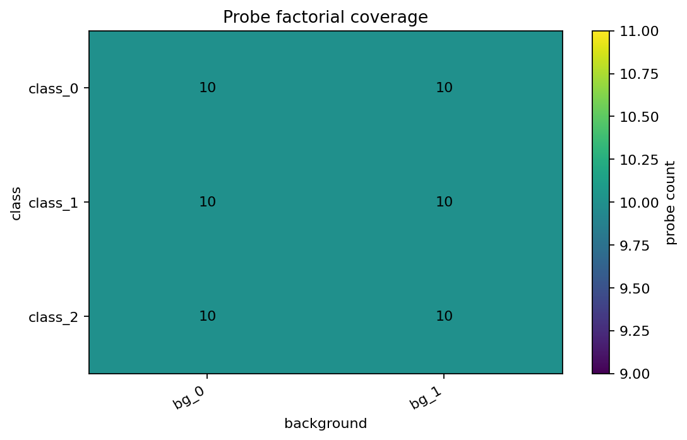

**Question.** Does the probe population actually distinguish the hypotheses of interest?

The demonstration plot verifies that all six class/background cells are represented equally. This is a prerequisite for asking whether internal organization follows class rather than background.

**Do not infer:** balanced counts do not prove that every nuisance variable is controlled.

## 2. Factor-ordered relational matrix

```python
fig = ef.visualization.relational_matrix_heatmap(
    layer,
    probes=result.artifacts.probes,
    factor="class",
)
```

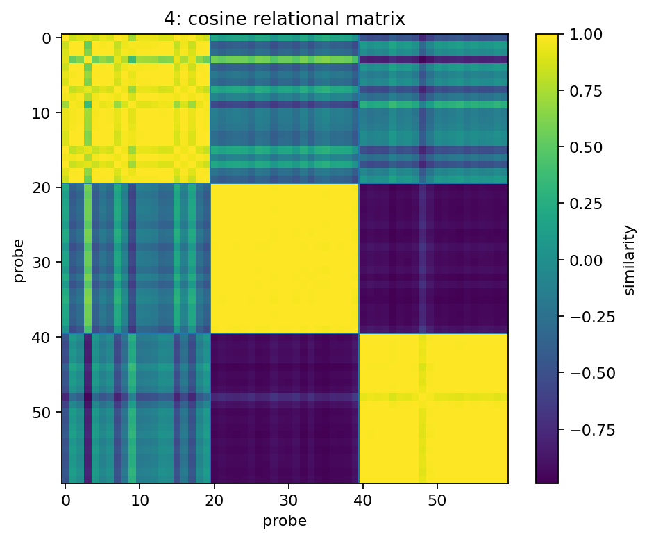

**Question.** What pairwise geometry exists before graph thresholding?

The heatmap exposes the actual pairwise object consumed by the filtration. Ordering probes by an experimental factor makes block structure, gradients, and outliers visible without first choosing a graph threshold.

**Do not infer:** visible blocks are conditional on the reducer and metric; they are not metric-independent latent classes.

## 3. Connected-component trajectory

```python
fig = ef.visualization.component_trajectory(
    layer,
    analysis="pcscs",
)
```

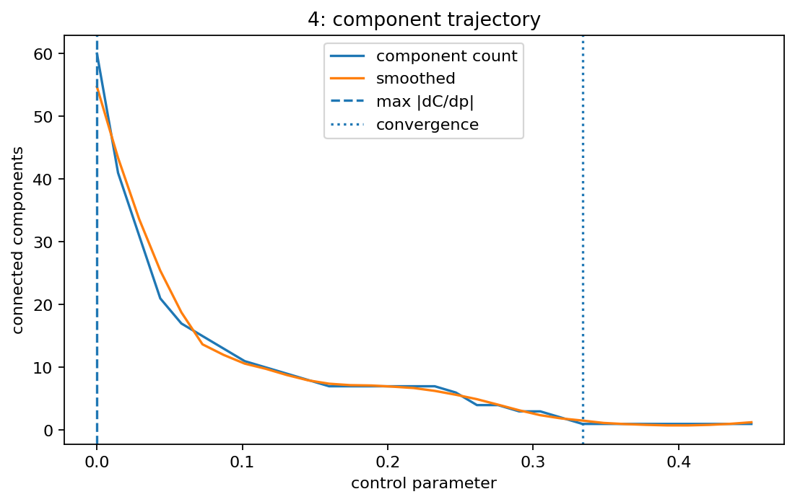

**Question.** How does fragmentation collapse as graph scale increases?

The raw curve is the number of connected components. The optional smoothed curve makes broad trend easier to inspect. PCSCS-style critical/max-derivative and convergence parameters are shown when available.

This is the direct Eigenflow generalization of the central PCSCS component-count visualization.

**Do not infer:** a maximal derivative is a descriptive transition statistic, not automatically a thermodynamic critical point or semantic event.

## 4. Component-membership raster

```python
fig = ef.visualization.component_membership_raster(
    layer,
    probes=result.artifacts.probes,
    factor="class",
)
```

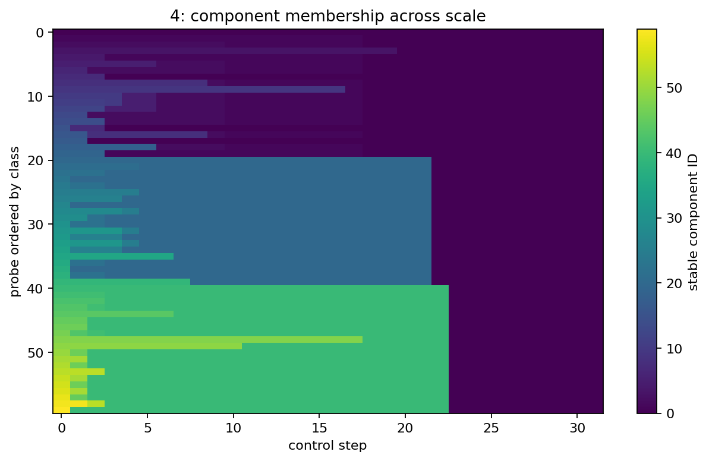

**Question.** Which probes remain structurally associated across control scale?

Rows are probes and columns are filtration steps. Stable component IDs are assigned from member indices so persistent groupings remain visually traceable as components merge. Ordering rows by class lets the analyst compare graph persistence with the controlled factor.

**Do not infer:** component colors are structural identifiers, not semantic labels.

## 5. Merge-event plot

```python
fig = ef.visualization.merge_event_plot(layer)
```

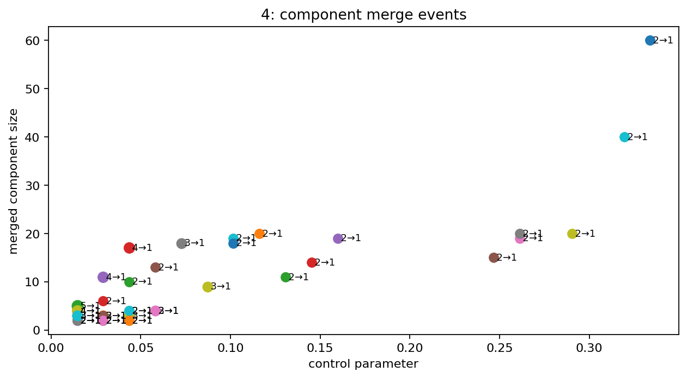

**Question.** When do multiple previously separate components become one connected group?

The event plot emphasizes discrete merger events and the size of the resulting component. It complements the component-count curve: the count says *how much* consolidation occurs, while merge events say *where* major consolidation occurs.

## 6. Dendrogram / merge hierarchy

```python
fig = ef.visualization.dendrogram_view(
    layer,
    probes=result.artifacts.probes,
    factor="class",
)
```

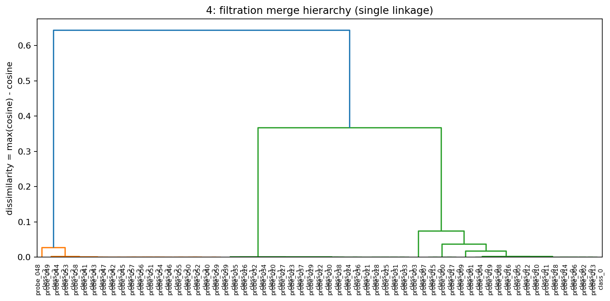

**Question.** What hierarchical merge order is implied by the pairwise geometry?

For threshold-connected components, the relevant hierarchy is the single-linkage hierarchy of the relational matrix. For similarity metrics, Eigenflow converts similarity to a monotone dissimilarity `max(similarity) - similarity` for the dendrogram axis.

This view preserves the PCSCS intuition that probe groups should be inspectable as a merge hierarchy.

**Do not infer:** this does not make the neural representation equivalent to an agglomerative clustering model, and branch height is not a metric-independent semantic distance.

## 7. Percolation / structural-transition dashboard

```python
fig = ef.visualization.percolation_dashboard(layer)
```

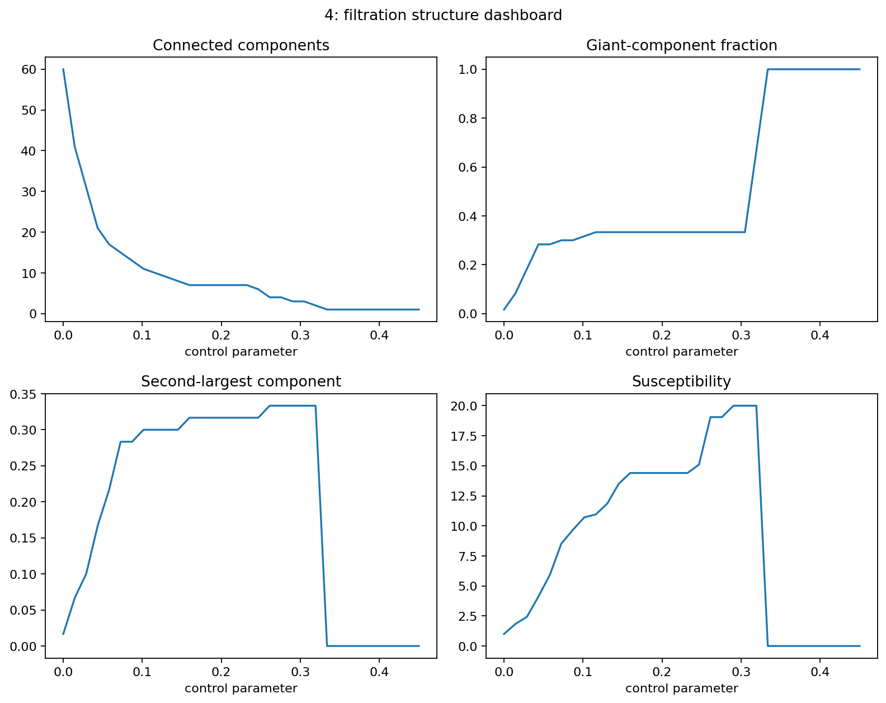

**Question.** How does the graph move from local fragmentation to macroscopic connectivity?

The dashboard aligns component count, giant-component fraction, second-largest component, and susceptibility on the same control scale. The four quantities describe different aspects of graph growth and should be read jointly rather than collapsed into a single score.

## 8. Graph snapshot

```python
peak = layer.analyses["percolation"].observables[
    "susceptibility_peak_parameter"
]
fig = ef.visualization.graph_snapshot(
    layer,
    parameter=peak,
    probes=result.artifacts.probes,
    factor="class",
    highlight_bridges=True,
    kcore=2,
)
```

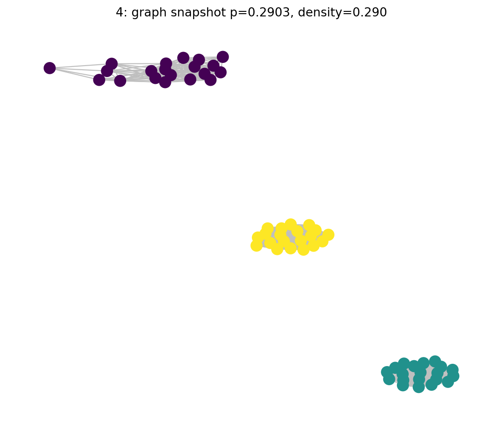

**Question.** What probes and relations are structurally pivotal at one selected graph state?

The node-link view is diagnostic. It can color nodes by a probe factor, enlarge k-core members, and highlight bridge edges.

**Do not infer:** spring-layout positions are drawing coordinates. They are not the learned representation geometry.

## 9. Static eigenvalue spectrum

```python
fig = ef.visualization.static_spectrum(
    layer,
    parameter=peak,
)
```

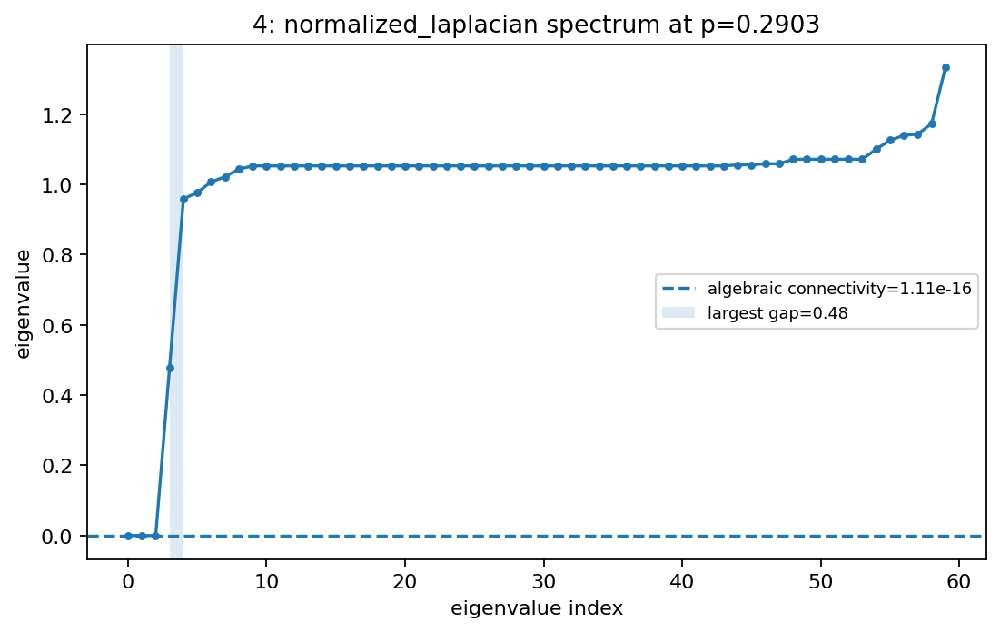

**Question.** What operator-scale structure exists at a selected graph state?

For Laplacian operators, the plot can expose zero modes, algebraic connectivity, and spectral gaps. It is the static counterpart to spectral flow.

## 10. Spectral flow

```python
fig = ef.visualization.spectral_flow(
    layer,
    max_modes=10,
)
```

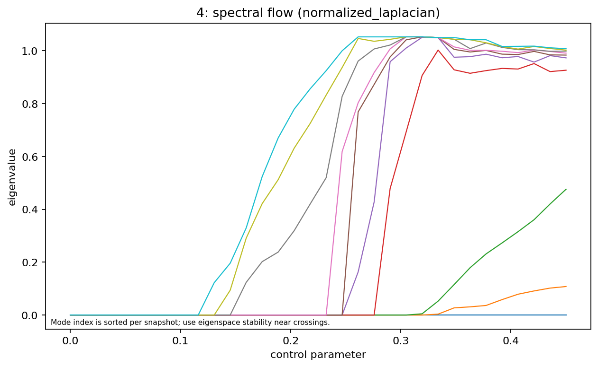

**Question.** How does the graph-operator spectrum evolve as the control parameter changes?

Each curve uses sorted eigenvalue index at each snapshot. The figure deliberately warns that sorted index is not mode identity through crossings or degeneracy. Use the eigenspace views below when correspondence matters.

## 11. Spectral-properties dashboard

```python
fig = ef.visualization.spectral_properties_dashboard(layer)
```

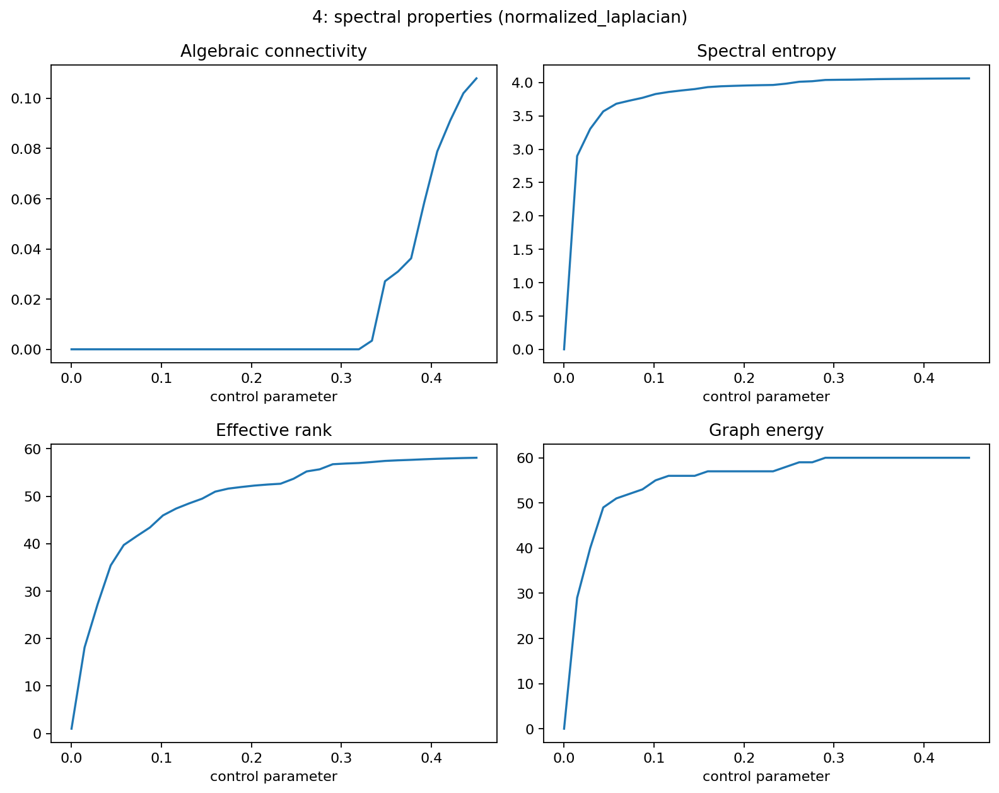

**Question.** How do complementary spectral summaries evolve jointly?

The default panel shows algebraic connectivity, spectral entropy, effective rank, and graph energy. These have different mathematical meanings. Agreement can provide convergent evidence; disagreement can identify a more specific structural change.

## 12. Localization / IPR trajectory

```python
fig = ef.visualization.localization_trajectory(
    layer,
    mode=1,
)
```

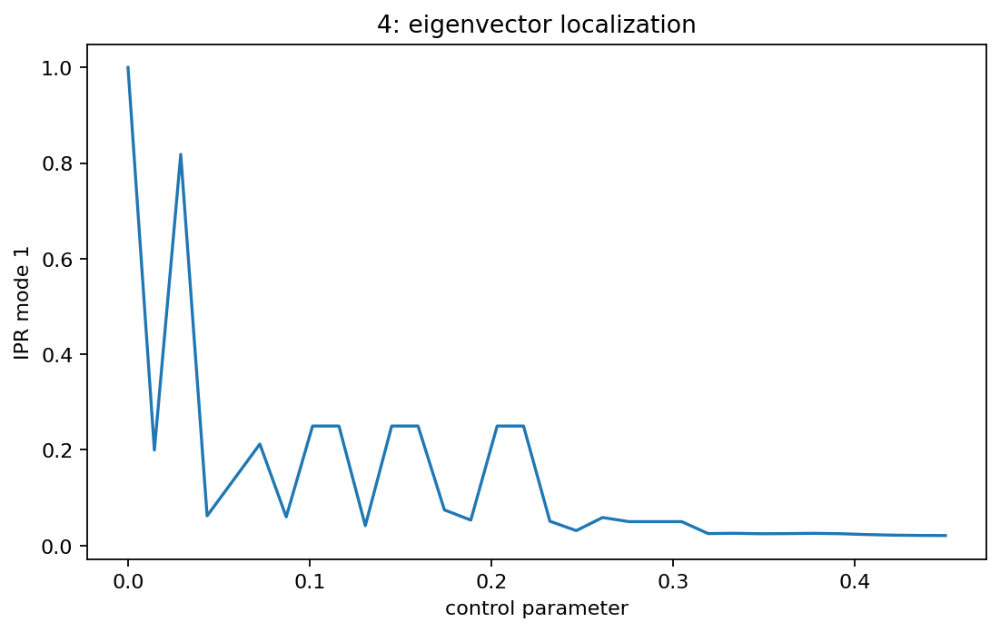

**Question.** Is a spectral mode distributed over many probes or concentrated on a small subset?

High inverse participation ratio indicates stronger localization. A dramatic spectral feature that is highly localized should trigger probe-level inspection before it is interpreted as population-wide organization.

## 13. Eigenspace stability

```python
fig = ef.visualization.eigenspace_stability(layer)
```

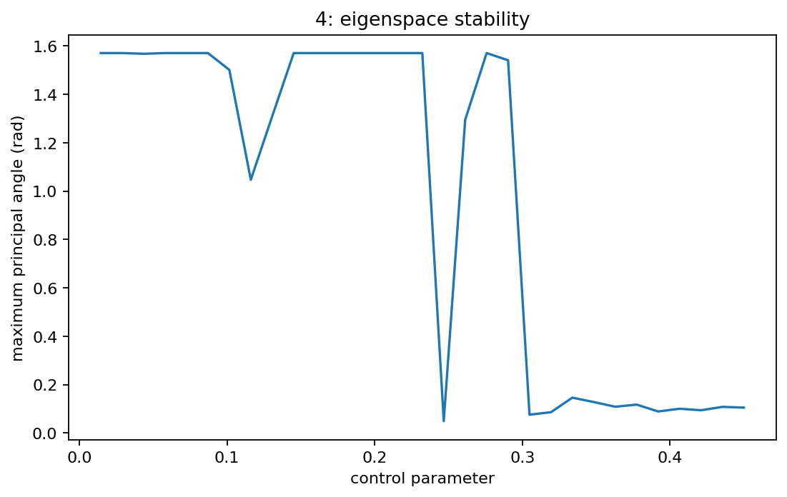

**Question.** Is the low-dimensional structural subspace stable between adjacent graph states?

The plotted value is the maximum principal angle between consecutive tracked eigenspaces. Large changes identify regimes where basis-level mode correspondence is particularly unsafe.

## 14. Eigenspace-overlap heatmap

```python
fig = ef.visualization.eigenspace_overlap_heatmap(layer)
```

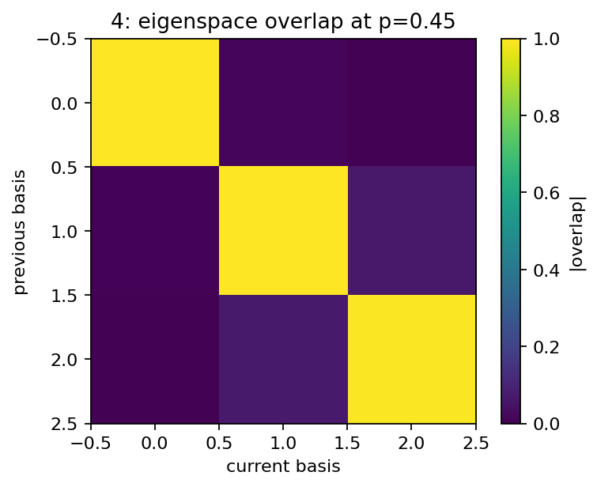

**Question.** How do basis vectors in two adjacent low-dimensional eigenspaces overlap?

This is a diagnostic complement to principal angles. Near a degenerate eigenvalue, interpret the subspace rather than insisting that one sorted eigenvector retain identity.

## 15. Factor-alignment trajectories

```python
fig = ef.visualization.factor_alignment_trajectory(
    layer,
    factors=["class", "background"],
    metric="nmi",
)
```

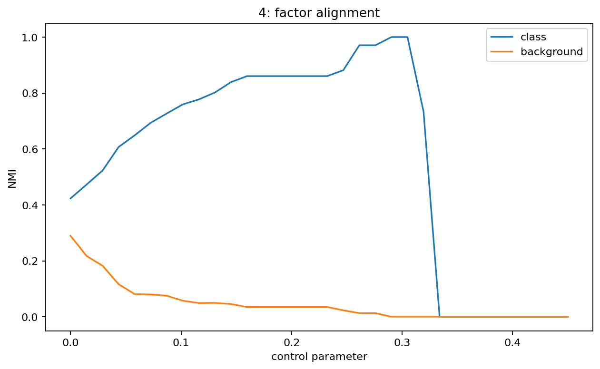

**Question.** Which controlled factor best aligns with the emergent component partition?

In the demonstration, class alignment reaches NMI = 1.0 at the final site, while background alignment remains much weaker. Because class and background are crossed in the probe design, this is meaningful evidence that the trained representation is more strongly organized by class than by the nuisance background factor.

**Do not infer:** NMI = 1.0 does not prove a unique class coordinate or causal mechanism.

## 16. Internal versus external factor connectivity

```python
fig = ef.visualization.factor_connectivity(layer)
```

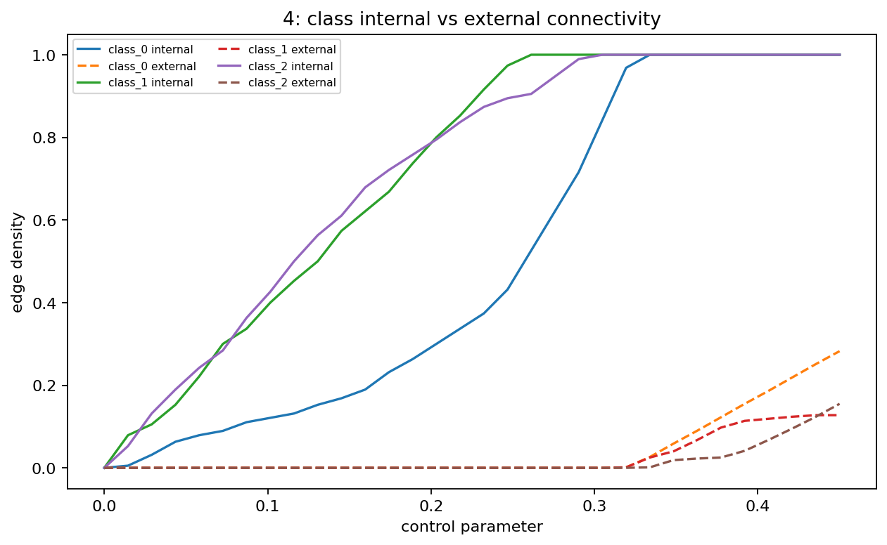

**Question.** Are probes within each class densely connected relative to cross-class mixing?

This view complements partition alignment with edge-level structure. High internal and lower external density identifies a regime of factor-consistent relational coherence.

## 17. Layer × control heatmap

```python
fig = ef.visualization.layer_control_heatmap(
    result,
    analysis="components",
    observable="component_count",
)
```

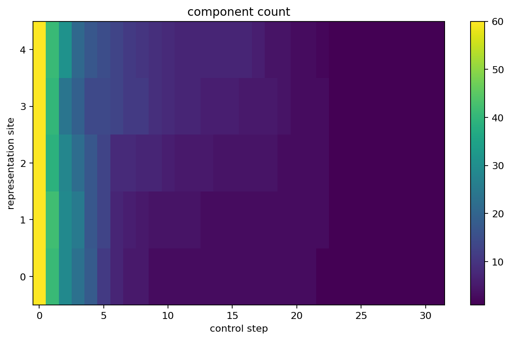

**Question.** Where across network depth and relational scale does an observable change?

This is a signature Eigenflow view because the experimental object is naturally `Q(layer, control)`. It exposes changes that would disappear if the analyst inspected only one layer or one threshold.

## 18. Combined-layer dynamics

```python
fig = ef.visualization.combined_layer_dynamics(
    result,
    analysis="components",
    observable="component_count",
)
```

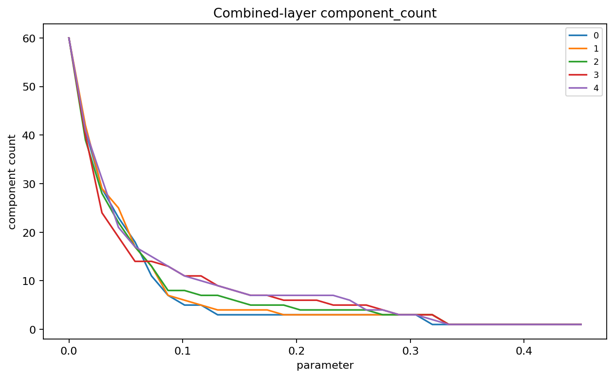

**Question.** How do complete structural trajectories compare across representation sites?

Use a common control coordinate such as edge density when raw thresholds are not commensurable across sites or metrics.

## 19. Bridge-probe frequency

```python
fig = ef.visualization.bridge_probe_frequency(
    layer,
    probes=result.artifacts.probes,
)
```

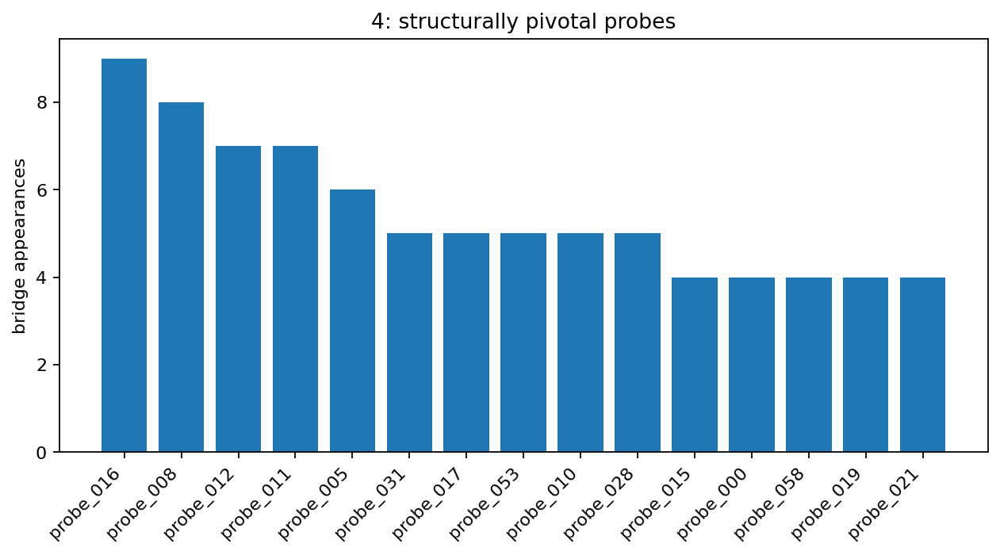

**Question.** Which probes repeatedly participate in graph bridges?

These probes are candidates for qualitative inspection because they repeatedly connect otherwise separable graph regions.

**Do not infer:** a frequently bridging probe is not automatically mislabeled or semantically ambiguous.

## 20. Measurement-robustness comparison

```python
fig = ef.visualization.robustness_comparison(
    [cosine_result, euclidean_result],
    labels=["cosine", "euclidean"],
    site=final_site,
    factor="class",
)
```

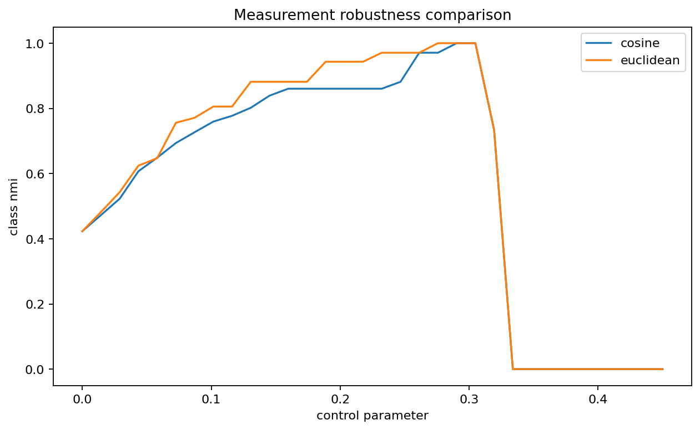

**Question.** Does the substantive factor-alignment conclusion survive a reasonable change in measurement geometry?

Both runs use edge density, so the x-axis compares graph states at matched retained-edge fractions rather than trying to compare raw cosine and Euclidean thresholds.

## 21. Cross-result structural summary

```python
fig = ef.visualization.cross_result_summary(
    [cosine_result, euclidean_result],
    labels=["cosine", "euclidean"],
)
```

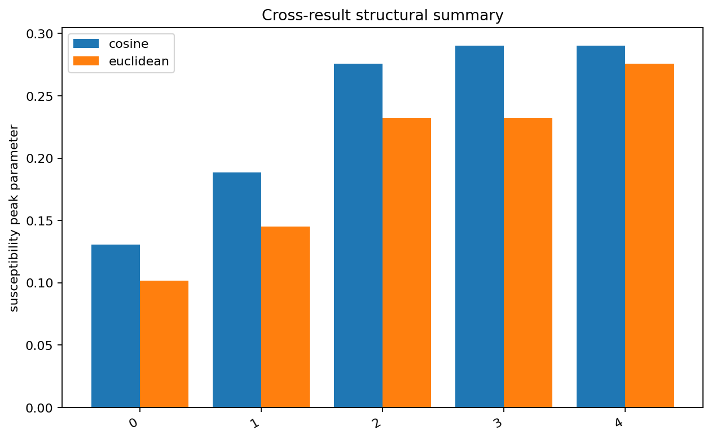

**Question.** How do scalar structural summaries differ across complete experiment results?

This is a report-level comparison. It should be read after the underlying trajectories, not as a replacement for them.

## 22. Experimental-interpretation dashboard

```python
fig = ef.visualization.interpretation_dashboard(
    layer,
    factor="class",
)
```

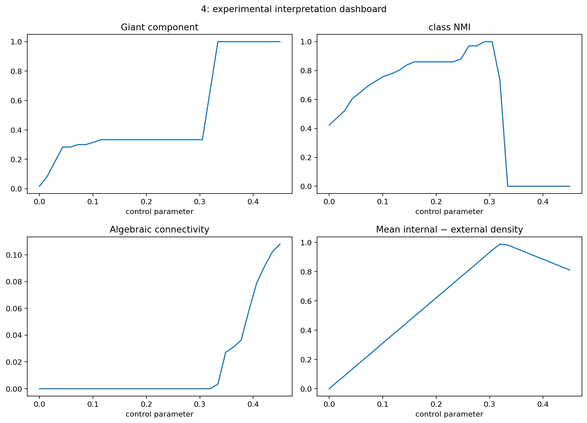

**Question.** What complementary evidence bears directly on the feature-organization hypothesis?

The default dashboard aligns giant-component growth, class NMI, algebraic connectivity, and mean within-minus-external class density. It is deliberately a synthesis of different measurements rather than a new composite score.

## Interpreting the complete demonstration

The synthetic model was trained to predict three classes while the probe design crossed class with an independent background factor. At every captured site, there exists a control regime with perfect class/component agreement. At the final site, class NMI reaches 1.0 while peak background NMI remains below 0.30. The characteristic susceptibility peak also moves from approximately 0.13 edge density at the first linear site to approximately 0.29 in the final representation.

A bounded interpretation is:

> Under this controlled probe design, the trained network contains strong class-aligned relational organization that remains distinguishable from the nuisance background factor. The characteristic graph scale of mesoscale consolidation changes through the network, and the conclusion can be checked against both cosine and Euclidean geometry at matched edge density.

Alternative explanations remain possible: the result is conditional on this finite synthetic population, the reducer, the two tested metrics, the selected graph construction, and the trained model. None of the visualizations establishes that class is represented by one neuron or that the observed structural organization is causally necessary for the prediction.

## Generating the complete artifact bundle

Run locally:

```bash
python examples/complete_visualization_demo.py \
  --output-dir eigenflow_visualization_demo_outputs
```

The script creates:

```text
eigenflow_visualization_demo_outputs/
├── figures/                 # every visualization above
├── tables/                  # training, probe, layer, spectral, factor data
├── native_result/result.json
├── trained_model_state.pt
├── configuration.json
├── environment.json
├── figure_manifest.csv
├── SHA256SUMS.csv
└── README.md
```

and then creates `eigenflow_visualization_demo_outputs.zip`.

For Google Colab, use `examples/eigenflow_colab_visualization_demo.py`. Set `EIGENFLOW_REF` to a commit or tag when an exact reproducible release is required.
